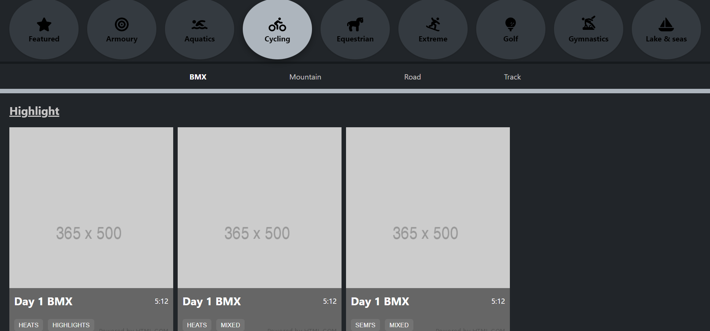

# sports-activities
<br>

# About the Website


### This solo frontend assignment made for TericSoft. In this react web application shows sports activities. Header contains sports categories, on click of any one shows that sports related activities.
<hr/>

## Important points
* Cards component is made in Class component.
* Others components is made in Functional component.
* All icons are used from font awesome icons.
* placeholder image used as alternative of images
<hr/>

## Steps to run application on local server

* Clone this repository locally than to following for starting local server for backend or frontend.

* <kbd>npm start</kbd> ==> After clone you on main folder you will see db.json that content all backend data. For this project I used json-server for making backend development.
  
 * <kbd>npm run dev</kbd> ==> On main folder you will see a folder you will see all frontend files to run react server pass command npm run dev in terminal. Or you can visit deployed link for this project.
<hr/>

## TechStacks
* React
* Redux
* React-router
* Json-server
* NodeJS
* JavaScript
* CSS
* Heroku
* Vercel
<hr/>

## Deployed Link

```bash
  https://deepu2560-sports.vercel.app/
```


# Features

* ##  Cycle Page

<br />
